```mermaid
classDiagram
  class Student
  Student : +StudentID  ID
  Student : +String     FirstName
  Student : +String     LastName
  Student : +Int        Age
  Student : +String     Gender
  Student : +Date       Birthday
  Student : +DateTime   EntriedAt
  Student : +FullName()

  class StudentService
  StudentService : +EntryCarriculum(CarriculumID)
  StudentService : +RemoveCarriculum(CarriculumID)
  StudentService : +AttendLecture(LectureID)
  StudentService : +LeaveLecture(LectureID)
  StudentService : +AbsentLecture(LectureID)

  class StudentID
  StudentID : +String value
  StudentID : +Value()
  
  class Instructor
  Instructor : +InstructorID  ID
  Instructor : +String        FirstName
  Instructor : +String        LastName
  Instructor : +Int           Age
  Instructor : +String        Gender
  Instructor : +Datetime      
  Instructor : +EntryCarriculum(carriculum)
  Instructor : +RemoveCarriculum(carriculum)
  Instructor : +AttendLecture(carriculum)
  Instructor : +LeaveLecture(carriculum)
  Instructor : +AbsentLecture(carriculum)

  class InstructorID
  InstructorID : +String value
  InstructorID : +Value()

  class Room
  Room : +RoomID  ID
  Room : +String  Name
  Room : +String  Location
  Room : +Boolean Available
  Room : +isAvailable()

  class RoomID
  RoomID : +String value
  RoomID : +Value()

  class Carriculum
  Carriculum : +CarriculumID  ID
  Carriculum : +String        Name
  Carriculum : +String        Detail
  Carriculum : +DateTime      Begin
  Carriculum : +DateTime      End
  Carriculum : +Instructor    PIC
  Carriculum : +IsBegin()
  Carriculum : +IsEnd()

  class CarriculumID
  CarriculumID : +String value
  CarriculumID : +Value()
```

# 設計

## 学生: Student

ユースケース
- 講義
  + 出席
  + 退席
  + 欠席

- カリキュラム
  + 登録
  + 削除

- 教室
  + 入室
  + 退室

## 教員: Instructor

ユースケース
- 講義
  + 出席
  + 退席
  + 欠席

- カリキュラム
  + 登録
  + 更新
  + 削除
 

- 教室
  + 入室
  + 退室
  

## カリキュラム: Curriculum
ユースケース
なし

## 講義: Lecture

ユースケース
なし

## 教室: Room
ユースケース
なし

